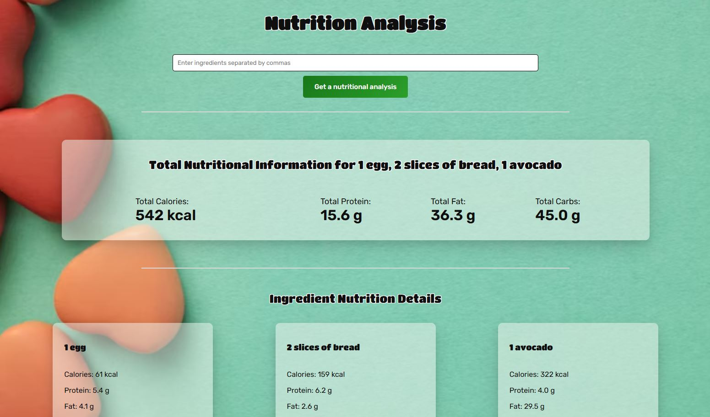

# Nutrition Analysis

## Demo  
🔗 View the app on Netlify(https://project-nutrition-analysis.netlify.app)

## Project Description

**Nutrition Analysis** is a React-based application that performs a detailed nutritional analysis of ingredients entered by the user.

The app sends a **POST request** to the **Edamam API**.  
Users enter one or multiple ingredients with quantities into the search input. After pressing **Enter** or clicking the search icon, the application displays:
- A total nutritional analysis
- A detailed nutritional breakdown for each individual ingredient

The application is built using **React (Vite)** and consists of three main components:
- The main component, which contains the application logic, title, and search input
- A component that calculates and displays the total nutritional analysis
- A component that renders the nutritional analysis for each ingredient using the `.map()` method

To improve readability and avoid overwhelming the page with excessive data, additional nutritional details for each ingredient (such as vitamins, minerals, etc.) are displayed using an **accordion**.

The app uses the `useEffect` hook to perform the API request and four `useState` hooks:
- One state stores the user input
- The second state stores the formatted data used for the POST request
- The third state stores the response data received from the API
- The fourth state controls the display of a loading indicator

If the ingredients are entered incorrectly, cannot be recognized by the API, or if an error occurs during the request, an error message is displayed.

No installation is required.

## Here's what the app looks like:

## How to Use:
- Enter one or more ingredients with quantities into the search input  
  (for example: *2 eggs, 100g rice, 1 apple*)
- Press **Enter** or click the **search icon**
- The app will display the total nutritional analysis and a detailed breakdown for each ingredient

## Features:
- POST request to the Edamam API for nutritional analysis
- Total nutrition calculation
- Ingredient-based nutrition breakdown rendered with `.map()`
- Accordion for displaying additional nutritional details
- API data fetching using `useEffect`
- State management using multiple `useState` hooks
- Loading indicator during API requests
- Error handling for invalid input or API errors
- Clean and user-friendly interface

## Requirements:
- A modern web browser
- JavaScript enabled

